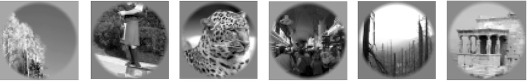
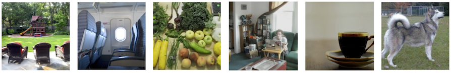

# Index of Neuroimaging Datasets for Visual Perception Reconstruction

This repository indexes open neuroimaging datasets for reconstructing visual perception **from human fMRI data**. 

This guide is primarily aimed at researchers from AI and machine learning backgrounds who may not be familiar with neuroimaging methodology. Reconstruction from neuroimaging data has recently gained popularity at major AI conferences, but many approaches fall into **common traps** that are well known within neuroscience. These pitfalls can lead to misleading results, often due to misunderstandings about the nature of fMRI data or the limitations of datasets originally collected for other research questions. For a detailed discussion of such issues in recent reconstruction pipelines, see: Shirakawa, K. et al. (2025). [*Spurious reconstruction from brain activity*](https://www.sciencedirect.com/science/article/pii/S0893608025003946), _Neural Networks_ .

## Table of Contents
1. [Basics: Identification vs. Decoding vs. Reconstruction](#basics-identification-vs-decoding-vs-reconstruction)
2. [Criteria for Reconstruction Datasets](#criteria-for-reconstruction-datasets)
3. [Image Stimulus Datasets](#image-stimulus-datasets)
   - [vim-1](#vim-1)
   - [BRAINS](#brains)
   - [Miyawaki Dataset](#miyawaki-dataset)
   - [BOLD5000](#bold5000)
   - [Generic Object Decoding](#generic-object-decoding)
   - [Natural Scenes Dataset](#natural-scenes-dataset)
   - [THINGS-fMRI](#things-fmri)
   - [cNeuromod-THINGS](#cneuromod-things)
4. [Video Stimulus Datasets](#video-stimulus-datasets)
   - [vim-2](#vim-2)
   - [Doctor Who Dataset](#doctor-who-dataset)
   - [cNeuromod Video](#cneuromod-video)
   - [fMRI Data and Hemodynamic Delay](#fmri-data-and-hemodynamic-delay)

## Basics: Identification vs. Decoding vs. Reconstruction

These terms are now often conflated. In foundational reconstruction and decoding literature their separation has been strict for good reasons: the tasks differ in difficulty, failure modes, what can be concluded from a result and what a method can realistically achieve. 

**True reconstruction requires potential to generalize to stimuli and categories that were not present during training.** If the correct answer is (also implicitly) selected from a predefined candidate category or image set, the wording is _decoding_ or _identification_, not reconstruction. 

| Neuroscience term | ML framing | Search space | Difficulty |
|---|---|---|---|
| **Decoding** | classification | closed label/category set | easy |
| **Identification** | retrieval | finite set of images | moderate |
| **Reconstruction** | generative inverse problem | infinite, open set of perception | hard |

- **Decoding (category level)**  
 Decoding refers to predicting (classifying) pre-defined labels or cognitive states from brain activity patterns. This type of classification has long been used for [neuroscientific insight](https://www.cell.com/neuron/fulltext/S0896-6273(15)00432-8). In multivariate pattern analysis (MVPA), voxel activity patterns are treated as feature vectors and classifiers are trained to distinguish experimental conditions (for example risky vs. safe decision, add vs. subtract, rule A vs. rule B).

  Decoding is scientifically useful because it tests whether information about a stimulus or mental state is present in a brain region. However, this is constrained to a predefined closed set, arbitrary mind or visual content can not be recovered. 

  Many recent papers labeled as “reconstruction” are effectively performing n-way decoding: they decode a category and then use a generative model to produce a visually plausible sample inside the predicted class. This can look convincing, but remains a restricted classification problem. Similar n-way decoding setups have long been standard in the MVPA literature and can achieve quite high performance when the candidate set is limited.

- **Identification (stimulus level)**  
  Identification refers to selecting which stimulus was shown from a finite set of candidates based on brain activity. For example, given N possible images, the task is to determine which one produced the observed brain response. While interesting and useful, particularly within large stimulus sets, it remains a selection problem within a predefined set.

- **Reconstruction (open-set stimulus inference)**  
  Reconstruction aims to rebuild the stimulus itself from brain activity, generalizing to **novel stimuli outside the training set**. Because the space of possible visual stimuli is essentially infinite, this is a substantially harder problem than decoding or identification.

  A long-term motivation for reconstruction research is the possibility of recovering **internally generated visual experiences**, such as mental imagery or even [**dreams**](https://www.science.org/doi/10.1126/science.1234330). In these settings there is obviously no predefined candidate set of images to choose from.

## Criteria for Reconstruction Datasets

This index contains dataset that are either suitable or have been commonly used for reconstruction research. 

Not every fMRI dataset that contains visual stimuli is suitable for reconstruction research. Many datasets were originally collected for other purposes (for example category decoding or representation analysis).

Here are suggested criteria to take into account when evaluating whether to use a particular neuroimaging dataset for your project.

- **Train–test independence**  
  Training and test stimuli should be visually and semantically distinct. If both sets contain highly similar images or share the same object categories or semantic clusters, models may simply learn to classify stimuli into known clusters instead of reconstructing novel images.

- **Stimulus diversity**  
  Reconstruction models must generalize beyond the training set. Datasets with limited semantic diversity restrict the feature space that models can learn. If your test set is truly independent (see first point), this limitation will typically become visible in reconstruction quality.

- **Visual field coverage**  
  Visual field coverage determines how much of the visual cortex map is stimulated. Larger stimuli (=higher visual field coverage) that cover more of the visual field activate a larger portion. For reconstruction research this matters greatly. When stimuli cover more of the visual field, voxels carry more fine-grained visual information, particularly in early visual cortex. Datasets with larger visual field coverage are therefore generally preferred for reconstruction.

- **Voxel size**  
  The spatial resolution (pixel size) of the recordings. Stronger scanner magnetic fields (e.g. 7T) will allow for smaller voxels which enables more fine-grained analyses. 

- **Fixation**  
  Most visual neuroimaging experiments require participants to fixate on a point in the center of the screen during stimulus presentation. This is important because large parts of the visual system are retinotopically organized (a distorted retina-reflecting map). If participants freely move their eyes, the same image stimulates different parts of this cortical map. Eye movements can introduce strong confounds: models may end up decoding eye position on the cortical map and not stimulus-related cortical patterns. There is debate about the strict necessity of fixation though. It also reduces natural viewing behavior and may suppress activity in higher-level visual areas. In general, reconstruction on free-viewing datasets should be approached with caution.

- **Repetitions and signal-to-noise ratio (SNR)**  
  fMRI signals are noisy. Many reconstruction-oriented datasets therefore include many repeated presentations of the test stimuli (_resampling_). Averaging across repetitions improves signal quality (SNR) and makes voxel-level patterns more reliable. Single-shot reconstruction is rarely seen outside invasive (implant) recording contexts and even there often produces substantially lower quality than reconstructions from resampled stimuli. If your pipeline is strong enough, however, it is worth trying.

- **Number of subjects**  
  Fine-grained functional organization varies substantially across individuals. For this reason, many reconstruction projects prefer datasets with many images shown to few healthy individuals ([deep sampling](https://doi.org/10.1016/j.cobeha.2020.12.008)) rather than those with few images for many subjects. There are efforts to learn across-individuals.

- **Copyright and availability of stimulus files**  
  Reconstruction requires access to the original images or videos. Datasets where stimulus material cannot be redistributed (for example due to copyright restrictions) can be difficult to use in practice. Journals have occasionally required researchers to redraw copyrighted original stimuli by hand, or only show CC0/public domain images, which is not ideal for presenting reconstruction results.

- **Smoothing in preprocessing**  
  Modern vision datasets tend to avoid this step, but do double-check whether spatial smoothing was applied. This standard fMRI step applies a Gaussian filter across voxels and effectively blurs your signal. For reconstruction (and other pattern-based analyses), this can destroy fine-grained spatial information. Note that as an ML researcher you may not easily be able to modify the extensive preprocessing and GLM pipeline yourself without assistance from someone with fMRI expertise, in order to exclude this step.

## Image Stimulus Datasets

### vim-1

| Attribute | Details |
|---|---|
| **Stimulus type** | naturalistic grayscale images |
| **Stimuli** | 1750 training images, 120 test images |
| **Fixation** | yes |
| **Repetitions** | train: 2×, test: 13× |
| **Subjects** | 2 |
| **Visual field coverage** | 20° |
| **Brain regions** | visual cortex V1-V4, LatOcc, extrastriate (unspecified) regions |
| **Voxel size** | 2.0 mm³ isotropic |
| **Main publication** | [Kay et al., 2008](https://doi.org/10.1038/nature06713) |
| **Data access** | [CRCNS dataset page](https://crcns.org/data-sets/vc/vim-1) |

**Experiment**

Two participants viewed natural grayscale images while maintaining fixation. Images were presented inside a circular aperture. 

**Notes**
- The **“MNIST of computational visual neuroscience”** because of its small size, clean design, high number (13) of test repetitions, and wide use in encoding and reconstruction. Many reconstruction and encoding model projects use this dataset as a first test.
- The dataset was originally used to demonstrate voxel-wise encoding models and do stimulus identification by inverting them.
- Easy-to-use ROI masks for early visual cortex, mid/higher level regions also covered.
- Broad semantic categories.

### BRAINS

| Attribute | Details |
|---|---|
| **Stimulus type** | handwritten characters |
| **Stimuli** | 288 train images, 72 test images 
| **Fixation** | yes |
| **Repetitions** | train: 2×, test: 2× |
| **Subjects** | 2 |
| **Brain coverage** | 3T early visual cortex |
| **Voxel size** | 2.0 mm³ isotropic |
| **Visual field coverage** | ~9° |
| **ROIs** | V1 and V2 |
| **Main publications** | [Schoenmakers et al., 2013](https://doi.org/10.1016/j.neuroimage.2013.07.043), [Schoenmakers et al., 2015](https://doi.org/10.3389/fncom.2014.00173) |
| **Data access** | [Donders Repository dataset page](https://doi.org/10.34973/7201-s161) |

**Experiment**

Participants viewed the handwritten characters B, R, A, I, N, S while maintaining fixation. 

**Notes**

- Small and controlled dataset focused on early visual cortex (V1–V2). 

**Note for reconstruction research**

The stimulus space is MNIST-like structured and small. Reconstruction experiments focus on details in character shape. Generalization capabilities should not be expected, but it can be used to investigate new models and study fine-grained structural questions including class bias. 

### Miyawaki Dataset

| Attribute | Details |
|---|---|
| **Stimulus type** | 10×10 pixel patterns |
| **Stimuli** | train: 440 random patterns; test: geometric shapes / letters |
| **Fixation** | yes |
| **Repetitions** | train: 1×; test: 13× |
| **Subjects** | 2 |
| **Brain coverage** | 3T partial visual system |
| **ROIs** | V1, V2 |
| **Visual field coverage** | ~12° |
| **Voxel size** | 3.0 mm³ isotropic |
| **Main publication** | [Miyawaki et al., 2008](https://doi.org/10.1016/j.neuron.2008.11.004) |
| **Data access** | [brainliner data page](http://brainliner.jp/data/brainliner/Visual_Image_Reconstruction) |

**Experiment**  
Participants viewed binary 10×10 pixel patterns while maintaining fixation. Training patterns were random, test were letters and geometric shapes (see examples). 

**Note for reconstruction research**  
One of the first demonstrations of explicit visual _reconstruction_ from human fMRI. Reconstruction is performed by predicting the contrast value of each pixel location separately. Although the stimuli are simple, this pixel-wise reconstruction is still conceptually important for reconstruction projects. 

### BOLD5000

| Attribute | Details |
|---|---|
| **Stimulus type** | naturalistic images (SUN, COCO, ImageNet) |
| **Stimuli** | ~5200 images |
| **Fixation** | yes |
| **Repetitions** | most 1×, subset of 113 3×+ |
| **Subjects** | 4 |
| **Brain coverage** | 3T whole-brain |
| **ROIs** | visual cortex |
| **Visual field coverage** | ~4.6° |
| **Voxel size** | 2.0 mm³ isotropic |
| **Main publication** | [Chang et al., 2019](https://doi.org/10.1038/s41597-019-0052-3) |
| **Data access** | https://bold5000.org |

**Experiment**

Participants viewed natural images drawn from three common computer vision datasets (SUN scenes, COCO, and ImageNet). Each image was presented for 1s followed by a 9s of fixation, allowing the BOLD signal to return to baseline before the next image.

**Notes**

- Large and diverse stimulus set covering scenes, multi-object scenes, and single-object images.   
- Uses a slow fMRI design, which produces relatively clean single-trial BOLD responses.

### Generic Object Decoding

| Attribute | Details |
|---|---|
| **Stimulus type** | natural object images (ImageNet) |
| **Stimuli** | 1,200 train images (150 categories), 50 test images (50 unseen categories) |
| **Fixation** | yes |
| **Repetitions** | train: 5×, test: 35× |
| **Subjects** | 5 |
| **Brain coverage** | 3T whole-brain |
| **Voxel size** | 3.0 mm³ isotropic |
| **Visual field coverage** | 12° |
| **ROIs** | visual cortex (early and higher visual areas) |
| **Main publication** | [Horikawa & Kamitani, 2017](https://doi.org/10.1038/ncomms15037) |
| **Data access** | https://github.com/KamitaniLab/GenericObjectDecoding |

**Experiment**

Participants viewed natural object images from ImageNet categories while maintaining fixation. Training stimuli covered **150 object categories**. Test stimuli consisted of **50 images from categories not present in the training set**. 

**Notes**

- Specifically designed with reconstruction in mind. 
- Strict train–test category separation, which reduces visual and semantic overlap between training and test stimuli.

**Note for reconstruction research**

Because the test categories are not present during training, this dataset provides a useful benchmark for evaluating whether reconstruction models can generalize beyond the training categories. A small set of non-naturalistic abstract stimuli (e.g., crosses) from this data has been used widely and successfully to demonstrate reconstruction capability outside the (naturalistic) training distributions. 

### Natural Scenes Dataset

| Attribute | Details |
|---|---|
| **Stimulus type** | natural color images (MS COCO) |
| **Stimuli** | ~73,000 unique images total |
| **Fixation** | yes |
| **Images per subject** | ~10,000 unique images |
| **Repetitions** | 3x both train/test |
| **Subjects** | 8 |
| **Scanner** | 7T fMRI (high-res) |
| **Brain coverage** | whole brain |
| **Visual field coverage** | 8.4° |
| **Voxel size** | 1.8 mm³ isotropic |
| **Main publication** | [Allen et al., 2022](https://doi.org/10.1038/s41593-021-00962-x) |
| **Data access** | https://naturalscenesdataset.org |

**Experiment**

Participants viewed natural images from the **MS COCO dataset** during long-term scanning sessions (30–40 sessions per participant) while maintaining fixation. Each subject saw ~10,000 unique images repeated three times. About 1,000 images are shared across all subjects for cross-subject analysis. 

**Notes**

- Largest and highest-quality, highest resolution human fMRI datasets currently available.
- Widely used for encoding models, representational analysis, and large-scale brain–DNN comparisons.

**Note for reconstruction research**

NSD includes additional resources such as an [imagery experiment](https://arxiv.org/abs/2506.06898) and [synthetic images](https://www.nature.com/articles/s41467-026-69345-9).

The standard train/test split contains strong semantic clustering and substantial similarity between training and test images within the same MS COCO categories. This can inflate apparent reconstruction performance (see [Shirakawa et al., 2025](https://www.sciencedirect.com/science/article/pii/S0893608025003946)). For reconstruction studies it is advisable to create alternative splits where test stimuli contain categories not present during training, or where semantic and visual overlap between training and test images is minimized.

### THINGS-fMRI

| Attribute | Details |
|---|---|
| **Stimulus type** | naturalistic object images (THINGS database) |
| **Stimuli** | 8,640 unique images (720 categories, 12 images/category) |
| **Fixation** | yes |
| **Repetitions** | train 1×, test 12× |
| **Subjects** | 3 |
| **Brain coverage** | 3T whole-brain |
| **ROIs** | early visual cortex and category-selective regions (FFA, PPA, LOC, etc.) |
| **Visual field coverage** | ~10° |
| **Voxel size** | 2.0 mm³ isotropic |
| **Main publication** | [Hebart et al., 2023](https://doi.org/10.7554/eLife.82580) |
| **Data access** | https://things-initiative.org |

**Experiment**

Participants viewed natural object images drawn from the THINGS object database while maintaining central fixation. 

**Notes**

- Large and systematically sampled object image set designed to study object representations across cortex.
- Includes extensive **functional localizers and retinotopy**, enabling ROI-based analyses. 

### cNeuromod-THINGS

| Attribute | Details |
|---|---|
| **Stimulus type** | natural object images (THINGS database) |
| **Stimuli** | ~4,320 images (720 categories, 6 images/category) |
| **Fixation** | yes |
| **Repetitions** | ~3× per image |
| **Subjects** | 4 |
| **Brain coverage** | 3T whole-brain |
| **Voxel size** | ~2mm³ isotropic |
| **Visual field coverage** | ~10° |
| **Main publication** | [St-Laurent et al., 2026](https://doi.org/10.1038/s41597-026-06591-y) |
| **Data access** | [Zenodo data page](https://zenodo.org/records/17881592) |

**Experiment**

Participants viewed object images from the THINGS object database while maintaining central fixation. 

**Notes**  
- Part of the [CNeuroMod deep-phenotyping project](https://www.cneuromod.ca), where a small number of participants are scanned extensively across tasks like video watching, narratives, video games, and other tasks.

**Note for reconstruction research**  
Because the dataset uses the same participants as the cNeuromod project, models can potentially be trained on all its visual data. Note that cNeuromod-THINGS uses central fixation, while several other cNeuromod recordings use natural viewing (see criteria).

## Video Stimulus Datasets

### vim-2

| Attribute | Details |
|---|---|
| **Stimulus type** | naturalistic videos (movie clips) |
| **Stimuli** | ~7200 training timepoints, 540 test timepoints |
| **Fixation** | yes |
| **Repetitions** | train: 1x, test: 10x |
| **Subjects** | 3 |
| **TR** | 1s |
| **Visual field coverage** | 20° |
| **Voxel size** | 2.0×2.0×2.5 mm³ |
| **Brain regions** | visual cortex |
| **Main publication** | [Nishimoto et al., 2011](https://doi.org/10.1016/j.cub.2011.08.031) |
| **Data access** | [CRCNS dataset page](https://crcns.org/data-sets/vc/vim-2) |

**Experiment**

Three participants viewed natural movie trailers at half speed while maintaining fixation. Videos were presented in grayscale and slowed to half speed to better match the hemodynamic delay of the BOLD signal.

**Notes**

- Reconstruction from Nishimoto 2011 (YouTube link)  

- The dataset was originally used to demonstrate encoding models with motion energy features. Reconstruction was done to demonstrate the power of these features to represent brain activity. 
- Similar high quality and easy to use as vim-1.
- Some train–test overlap has been reported, see [Shirakawa et al., 2025](https://www.sciencedirect.com/science/article/pii/S0893608025003946).

### Doctor Who Dataset

| Attribute | Details |
|---|---|
| **Stimulus type** | naturalistic video (TV series episodes) |
| **Stimuli** | ~23 hours (~120,000 fMRI images) of continuous video (30 episodes) |
| **Fixation** | yes |
| **Repetitions** | train: 1×, test: 22–26× |
| **Subjects** | 1 |
| **Brain coverage** | 3T whole-brain |
| **Voxel size** | 2.4 mm³ isotropic |
| **ROIs** | V1–V3, FFA, MT, language localizers |
| **TR** | 700ms |
| **Visual field coverage** | ~20° |
| **Data paper** | [Seeliger & Sommers et al., 2019](https://www.biorxiv.org/content/10.1101/687681v1.abstract) |
| **Data access** | [Donders Repository](https://doi.org/10.34973/j05g-fr58) |

**Experiment**

A densely sampled single-participant fMRI dataset recorded during viewing of BBC *Doctor Who* episodes. The experiment produced ~120,000 training volumes from full episodes and a separate test set of short narrative clips  (different Doctor incarnation) repeated ~22–26 times. The participant maintained fixation throughout the recording. 

**Notes**
- Deep single-brain dataset designed for end-to-end learning on neuroimaging data. 
- The stimuli are copyrighted and need to be constructed from the original Blu-ray discs (see criteria). 
- Example reconstruction work: [Le et al., 2022 (Brain2Pix)](https://www.frontiersin.org/journals/neuroscience/articles/10.3389/fnins.2022.940972/full)

### CNeuroMod video

| Attribute | Details |
|---|---|
| **Stimulus type** | naturalistic videos (movies, TV series) |
| **Stimuli** | 7 seasons of friends, 10 movies |
| **Fixation** | no |
| **Repetitions** | 1× |
| **Subjects** | 6 |
| **Brain coverage** | 3T whole-brain |
| **Voxel size** | ~2mm isotropic |
| **TR** | 1.49s |
| **Visual field coverage** | ~10° |
| **Data access** | https://www.cneuromod.ca/ |

**Experiment**

The **Courtois NeuroMod project** is a long-term deep-sampling dataset where 6 participants were scanned extensively across many cognitive tasks over multiple years. Each subject contributed **~200 hours of fMRI recordings** across movie watching, language, memory, images and videogame tasks. It is the current largest dense single-brain fMRI dataset, designed to support neuroAI research across many cognitive domains.

**Note for reconstruction research**

Vision-related datasets include very high amounts of naturalistic video. 

The naturalistic video datasets in cneuromod do not enforce fixation and allow free viewing (see criteria). Reconstruction experiments using these datasets should consider and account for potential eye movement influences. 

### fMRI Data and Hemodynamic Delay

fMRI records blood-oxygenation changes (the BOLD signal) following neural activity. fMRI data is organized as voxel-wise activity measurements in a 3D volume (voxels are 3D pixels), which – unlike many other neuroimaging modalities – makes it straightforward to use with standard machine learning methods.

Among non-invasive neuroimaging modalities, fMRI offers the best spatial resolution, which enables detailed localization of brain activity. Unlike invasive recording methods, it can also cover the whole visual system and the whole brain and can easily be recorded in healthy humans. fMRI is slow however, the _sampling rate_ (TR) usually being in the range of seconds, which impacts continuous stimuli such as video. 

The BOLD response typically peaks ~4–6 seconds after neural firing and returns to baseline after ~10–12 seconds. This means that the fMRI signal at time t reflects neural activity from several seconds earlier, i.e.: from the stimulus presented several seconds earlier. The image shows the canonical hemodynamic response function (HRF) presented in neuroscience literature and implemented in many frameworks. In practice, the exact shape and timing vary across voxels depending on vascularization and other physiological factors.

In large-scale visual neuroimaging experiments many stimuli are presented in rapid succession. To keep participants engaged and prevent fatigue, stimulus presentation is often continuous, which leads to substantial temporal overlap between successive HRFs.

This delay and overlap must be accounted for when aligning stimuli and brain activity.

For static image datasets this is usually already handled in the public releases, using a general linear model (GLM) that estimates the response to each stimulus.

For video datasets the situation is more complicated, because the stimulus is continuous. The HRF delay must therefore be taken into account when modeling, and there is currently no widely agreed-upon standard approach.

## Citation

If you found this index useful and want to cite it, please use:

K. Seeliger (2026). Neuro-Visual Reconstruction Dataset Index (v1.0). Zenodo. [https://doi.org/10.5281/zenodo.18876186](https://doi.org/10.5281/zenodo.18876186)

_If you know of additional datasets or have corrections, please open an issue or start a discussion._
